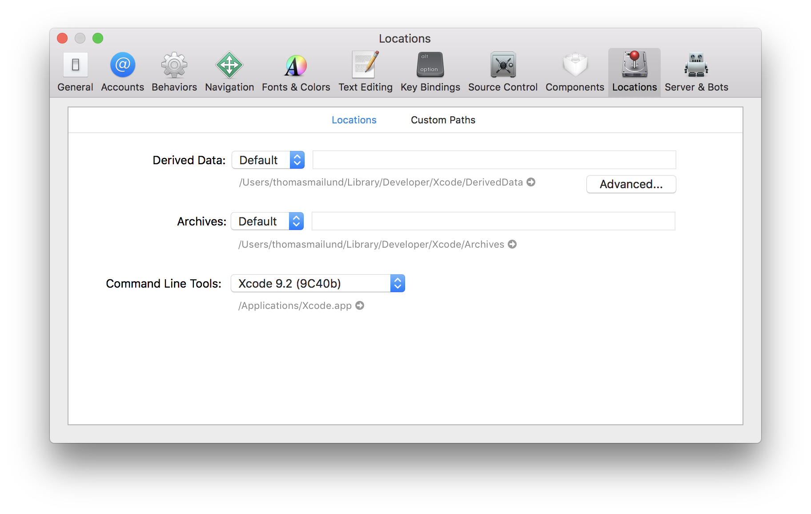

# Project 5 — Read mapper

The final project of this class, as we have hinted at from day one, is the implementation of a read-mapper. We will not implement a fully-fledged read-mapper—this would require us to take read quality and map quality into account—but we will build all the string-algorithm steps in a mapper.

Since it is the final project, you have more freedom in how you approach the project, but the minimum requirement of your read mapper is: *Your read-mapper should be able to find all approximative matches at a given edit-distance for all reads in a FASTQ file.*

For the first week of the project, you should implement step 1, where you simply do exact pattern matching of all reads. For the second week, you should implement step 2 and do approximative pattern matching. The last week, you should aim at making your read mapper as fast as you possibly can—step 3—where all tricks count.

We have provided some test data and read mappers you can use to test your program against, described below.

## Evaluation scripts

We have written some scripts for testing and evaluating read mappers that you can [get from here](https://github.com/mailund/gsa-read-mapper). These should work on any machine where you have `bash`, `make` and a C compiler installed. On Linux, you are likely to have these tools installed already. On Windows, you can install [Cygwin](https://www.cygwin.com) to get the tools. On macOS, you can install the necessary [command line tools](http://osxdaily.com/2014/02/12/install-command-line-tools-mac-os-x/) or install the command line tools in Preferences in Xcode.

If you have any problems with the test scripts, let us know, so we can fix any issues. Even better, make a pull-request on GitHub to the scripts, if you know how to fix your problems. If you cannot get it to work, we will adapt to that; the project material is still experimental since we haven’t used them before, but we hope they will help you in the project.

## Steps in developing your read mapper

To guide you through implementing your read mapper, we have split the project into three steps, described below. We want you to hand in progress reports at the end of each step; the report after step 3 will be the final report on the project.

### Step 1: Control flow of a read mapper

There are three basic steps your read-mapper should implement:

1. Read in the genomic sequence (from a FASTA file or an index structure you have created in a pre-processing step).
2. Scan through all reads (from a FASTQ file), searching for approximative matches.
3. Output matches (in the SAM format) for all reads that have an approximative match.

For the first step in building your read-mapper, you can focus on exact matching. So, build a tool that iterates through read and locate the positions for exact matches. You are free to choose any of the exact pattern-matching algorithms you have implemented to use in the read-mapper. Your aim is to make the mapper as fast as possible, so put some thought and experiments into choosing wisely.

From the exercises you did in the first week, you should already have parsers for FASTA and FASTQ files. From [Project 1](https://github.com/mailund/gsa-exercises/tree/master/Project01), [Project 2](https://github.com/mailund/gsa-exercises/tree/master/Project02) and [Project 4](https://github.com/mailund/gsa-exercises/tree/master/Project04) you should have implementations for exact pattern matching. You can pick any of those for your read-mapper. The only new code you need to implement for step 1 of the project is for outputting matches in SAM format. Other than that, you should be able to build the tool by combining code you have already written.

### Step 2: Approximate pattern matching

The second step in developing your read-mapper is adapting it to do approximative pattern matching. Your program should be able to take the maximal edit-distance for matches you allow as a parameter and should find all matches within that distance.

As an initial solution you can produce all strings in desired “edit-sphere” from the read and search for these strings using exact pattern matching approaches. This is likely to be very slow, though, so you should improve your tool using a more sophisticated algorithm.

We suggest that you implement one of the following solutions:
* Combine the edit-sphere around a read into a trie and use the Aho-Corsick algorithm to search for approximative matches. If you take this approach, you can use code you wrote in [Week 01](https://github.com/mailund/gsa-exercises/tree/master/Week01) to build the edit-sphere around a read.
* Use your suffix-tree to implement a search algorithm as described in the [slides from Week 10](https://www.dropbox.com/s/rvqq3b2ja5ovrbt/GSA%20Week%2010.pdf?dl=0).
* Adapt the Burrows-Wheeler exact pattern matching algorithm from [Project 4](https://github.com/mailund/gsa-exercises/tree/master/Project04) to implement the branch-and-bounds algorithm on page 378 (Algorithm 7.42) in the textbook.

If you use a suffix tree or a suffix array for your approximative pattern matching you should split preprocessing from searching in your tool, so the preprocessing step can be done, and the result saved to file(s), before the search.

### Step 3: Go-faster stripes

The final step in the project is open-ended. For this step, you should use all the tricks you can think of to make your read mapper as fast as possible. Measure its running time relative to `bwa` on the same data (you can do this using the scripts in the [read mapper evaluation setup](https://github.com/mailund/gsa-read-mapper) to do this).

In the final evaluation of the project, you should present the tricks that gave you the best speed-ups. There might be a price to win for the fastest read mapper, or for the group that come up with the smartest speed-up trick, so if you are competitive, this is where you can compete. We aim for friendly competition here, so don’t be afraid to share ideas. We won’t just choose the winner of the competition based on the raw speed-up — although that will be part of the evaluation — but also the relative speedup you get from your ideas. So be honest if you borrow ideas but don’t be afraid to incorporate good ideas from other groups.

## Deliverables

* **26/4:** Add your exact read-mapper to the `evaluation/evaluate_mappers_exact.sh` script and leave the other options unchanged. Run `make evaluate`. Upload the resulting `evaluation-report-exact.txt` file to blackboard
* **7/5:** Add your approximative read-mapper to the `evaluation/evaluate_mappers_approximative.sh` script and leave the other options unchanged. Run `make evaluate`. Upload the `evaluation-report-approximative.txt` file to to blackboard together with 1-2 slides describing the algorithm you have implemented and the programming language you have implemented it in.
* **26/5:** Upload an updated `evaluation-report-approximative.txt` file. If you think it is worthwhile you can explore the parameters of the read-mapper to examine how your algorithm performs under different configurations. Also, upload 2-3 slides where you describe what you have done to improve the performance of your program.

